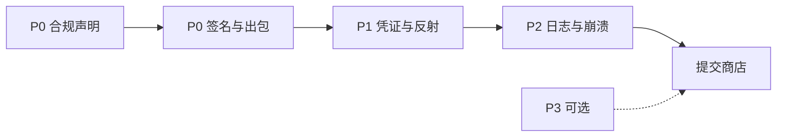

# HanTerm 上架计划（重排版）

> 日期：2026-07-24  
> 依据：对 Store Readiness 的工程评审（事实核对 + 上架阻塞 vs 安全债拆分）

---

## 目标

让 HanTerm 具备 **Google Play / 国内应用市场可提交、可过审、可签名出包** 的最低条件，并清掉上架前不可接受的凭证安全债。

非目标（本计划不做）：

- 引入 Hilt / 任何 DI 框架（`CLAUDE.md` hard constraint）
- 多主机 / SFTP / Mosh（Sprint 3+，需单独立项）
- 下调 `minSdk`（Issue #19 产品决策；本计划只开「决策 issue」，不默认实现）
- Kotlin 2.0 / Compose BOM 大升级（`ARCHITECTURE.md` 刻意锁定）
- 对 host/username 上 `EncryptedSharedPreferences`（威胁模型外，ROI 低）

---

## 优先级定义

| 级 | 含义 | 不上就怎样 |
|---|---|---|
| **P0** | 挡提交 / 挡过审 | 传不上去，或 Play 政策必填项缺失 |
| **P1** | 上架前安全债 | 不修也能传包，但凭证/非 SDK 风险不可接受 |
| **P2** | 稳定性 / 文档债 | 不影响过审，修了更稳、更可审计 |
| **P3** | 可选 / 决策 | 产品或体验项；默认不阻塞首发 |

---

## 工作流（建议顺序）

1. **先做 P0**：没有隐私政策 / Data safety / FGS·电池优化声明 / 正式签名，后面代码白改。
2. **并行 P1**：凭证脚枪、私钥落盘、`libcore` 路径——可与 Play Console 文案并行。
3. **P2 穿插**：XS 项（`DateTimeFormatter`、crash 轮转、KeyStore 注释）顺手合入。
4. **P3 首发后或单独决策**：Lifecycle ViewModel、字体状态提升、minSdk、i18n、无障碍。

---

## Issue 地图

| 优先级 | Issue | 工作量 | 类型 |
|---|---|---|---|
| — | [#31](https://github.com/st6098770633/ssh-pad-terminal/issues/31) Parent tracker | — | 计划 |
| P0 | [#32](https://github.com/st6098770633/ssh-pad-terminal/issues/32) Store compliance | S–M | 文档 + Console |
| P0 | [#33](https://github.com/st6098770633/ssh-pad-terminal/issues/33) Release signing + R8 | S | 构建 |
| P1 | [#34](https://github.com/st6098770633/ssh-pad-terminal/issues/34) Scrub legacy plaintext password | XS | 代码 |
| P1 | [#35](https://github.com/st6098770633/ssh-pad-terminal/issues/35) In-memory private key load | M | 代码 |
| P1 | [#36](https://github.com/st6098770633/ssh-pad-terminal/issues/36) Drop `libcore.*` reflection | S–M | 代码 |
| P2 | [#37](https://github.com/st6098770633/ssh-pad-terminal/issues/37) AppLog thread-safe timestamps | XS | 代码 |
| P2 | [#38](https://github.com/st6098770633/ssh-pad-terminal/issues/38) CrashHandler log rotation | XS | 代码 |
| P2 | [#39](https://github.com/st6098770633/ssh-pad-terminal/issues/39) Document KeyStore auth decision | XS | 文档/注释 |
| P3 | [#40](https://github.com/st6098770633/ssh-pad-terminal/issues/40) minSdk keep-or-reopen decision | — | 决策 |
| P3 | [#41](https://github.com/st6098770633/ssh-pad-terminal/issues/41) Lifecycle ViewModel + FontSize hoist | L | 代码 |
| P3 | [#42](https://github.com/st6098770633/ssh-pad-terminal/issues/42) i18n + accessibility | L | 代码 |

---

## 各优先级验收摘要

### P0 — 合规与出包

**Store compliance**

- [ ] 公开隐私政策 URL（GitHub Pages 或等价静态页）
- [ ] 声明：主机/用户名/加密凭证仅本地；会话内容不上传；AES-256-GCM + Android Keystore
- [ ] Play Console Data safety 表单与上述一致
- [ ] `FOREGROUND_SERVICE_SPECIAL_USE` 用途说明已填（SSH 会话保活）
- [ ] `REQUEST_IGNORE_BATTERY_OPTIMIZATIONS` 正当理由已写（OEM 冻 FGS → RST，见 BG-KA-06）
- [ ] 加密/出口合规问卷已答（SSH + AES）

**Release pipeline**

- [ ] `signingConfigs.release` 经环境变量注入，密钥不入库
- [ ] `assembleRelease` 产出正式签名 AAB/APK
- [ ] `minifyEnabled` + SSHJ/BC keep 规则；冒烟：连接、密码/公钥认证、FGS 通知

### P1 — 安全债

**Legacy password**

- [ ] 启动或 prefs 构造时 `remove(KEY_PASSWORD)`
- [ ] 删除或 `@Deprecated` + 测试禁用明文 setter
- [ ] 现有加密密码路径与 `AppPreferencesTest` 仍绿

**In-memory private key**

- [ ] 认证路径不写 `cacheDir/ssh-pad-key-tmp/`
- [ ] format detect + `FileKeyProvider.init(Reader)`（或等价）在内存完成
- [ ] OOM / 异常后 cache 无明文 PEM；`PublicKeyAuthProvider*Test` 覆盖

**Drop libcore path**

- [ ] `SshClient` 不再 `Class.forName("libcore.*")` / 对该路径 `setAccessible`
- [ ] 保留或加固 `android.system.Os.setsockoptInt`；失败时静默回退 SO_KEEPALIVE（现有行为）
- [ ] 更新 `ARCHITECTURE.md` keepalive 决策行

### P2 — 稳定性 / 可审计

- [ ] `AppLog` 时间戳线程安全（`DateTimeFormatter` 或 per-call SDF）
- [ ] `crash.log` 保留最近 ≥3 次（或带时间戳轮转）
- [ ] `KeyStoreManager` 显式 `.setUserAuthenticationRequired(false)` + 威胁模型注释（**不要**默认打开 biometric，除非另开 UX issue）

### P3 — 不阻塞首发

- **minSdk**：默认维持 36；若要降到 30，单独 Spec（FGS、Robolectric、BC、edge-to-edge 全盘回归）。
- **ViewModel / FontSizeController**：工程卫生，非商店要求。
- **i18n / a11y**：提升商店质量分；首发可后置。

---

## 明确不做（写进 tracker，避免再开）

| 原 READINESS # | 项 | 原因 |
|---|---|---|
| 8 | EncryptedSharedPreferences(host/user) | 威胁模型不防 root；库维护态 |
| 14 | Hilt | hard constraint：禁止 DI 框架 |
| 15 | 多主机 | Sprint 3+，需显式立项 |
| 18 | Kotlin 2.0 / BOM 大升级 | 架构刻意锁定 |

---

## 与源文档关系

| 文档 | 角色 |
|---|---|
| `docs/APP_STORE_READINESS.md` | 原始问题发现（保留作证据）；优先级以**本计划**为准 |
| `docs/APP_STORE_PLAN.md` | 执行计划与验收（本文） |
| `docs/ARCHITECTURE.md` | 实现后需回写的决策索引（keepalive 路径、威胁模型注释等） |
